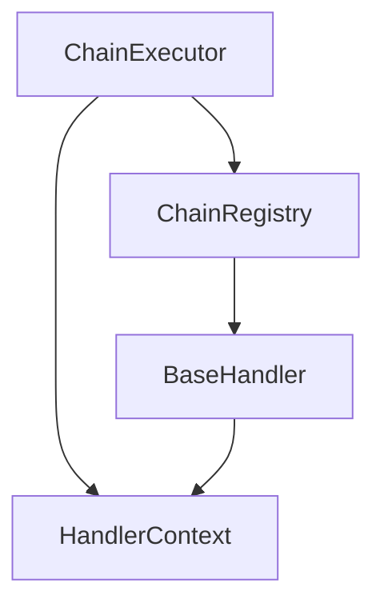

# Atlas-Chain：一个灵活的Java责任链框架设计与实现

在现代软件开发中，责任链模式是一种常见的设计模式，它允许将请求沿着处理者链进行传递，直到有一个对象处理它为止。这种模式可以有效地解耦请求的发送者和接收者，使得系统更加灵活和可扩展。本文将详细介绍Atlas-Chain责任链框架的设计思路、核心组件以及使用方法。

## 1. 概述

Atlas-Chain是一个基于Java的责任链框架，旨在简化责任链模式的实现与管理。该框架支持核心模块独立使用和Spring Boot集成，为Java开发者提供了一套完整、灵活且易于使用的责任链解决方案。

### 1.1 核心特性

Atlas-Chain框架具有以下核心特性：

- **注解驱动**：基于`@ChainHandler`注解的处理者自动注册机制
- **灵活配置**：支持同步/异步执行模式，可自定义线程池配置
- **类型安全**：通过泛型约束保证请求参数和响应结果的类型安全
- **节点控制**：支持处理者跳过机制和链路中断控制
- **模块化设计**：核心模块可独立使用，Spring Boot Starter模块提供无缝集成

## 2. 架构设计

### 2.1 核心组件

Atlas-Chain框架由以下核心组件构成：



#### 2.1.1 BaseHandler（处理者基类）

`BaseHandler<P, R>`是所有处理者的基类，定义了责任链中处理者的标准接口：

- `doHandle(HandlerContext<P, R> context)`：核心业务逻辑方法，返回true继续执行，false中断链路
- `shouldSkip(HandlerContext<P, R> context)`：判断是否跳过当前处理者
- `onCompleted(HandlerContext<P, R> context)`：处理完成回调
- `onError(HandlerContext<P, R> context, Exception e)`：处理异常回调

```java
@Slf4j
public abstract class BaseHandler<P, R> {
    /**
     * 子类必须实现的业务逻辑方法
     * 返回true表示继续执行下一个处理者，false表示中断链，不再执行后续节点
     * @param context 处理上下文
     * @return true继续执行，false中断执行
     */
    public abstract boolean doHandle(HandlerContext<P, R> context);
    
    /**
     * 可选实现：判断是否跳过当前处理者，默认不跳过
     * @param context 处理上下文
     * @return true跳过当前处理者，false不跳过
     */
    public boolean shouldSkip(HandlerContext<P, R> context) {
        return false;
    }
    
    // ... 其他回调方法
}
```

#### 2.1.2 HandlerContext（处理上下文）

`HandlerContext<P, R>`用于在处理者之间传递数据，包含：

- `request`：请求参数
- `response`：响应结果
- `attributes`：用于处理者间共享数据的键值对集合

```java
@Data
@AllArgsConstructor
@NoArgsConstructor
public class HandlerContext<P, R> {
    // 请求参数
    private P request;
    // 响应结果
    private R response;
    // attributes用于在责任链的不同节点之间传递数据
    private Map<String, Object> attributes = new HashMap<>();
    
    /**
     * 提供类型安全的属性获取方法
     * @param key 属性键
     * @param type 属性值类型
     * @param <V> 泛型类型
     * @return 指定类型的属性值
     */
    @SuppressWarnings("unchecked")
    public <V> V getAttribute(String key, Class<V> type) {
        return (V) attributes.get(key);
    }
    
    // ... 其他方法
}
```

#### 2.1.3 ChainRegistry（链注册器）

`ChainRegistry<P, R>`负责处理者的注册和管理：

- 提供处理者注册功能
- 构建指定链ID的责任链
- 管理所有已注册的链ID

```java
@Data
@NoArgsConstructor
public class ChainRegistry<P, R> {
    // 存储每个链ID对应的处理者列表
    private Map<String, List<BaseHandler<P, R>>> handlerMap = new HashMap<>();
    
    /**
     * 注册处理者
     * @param chainId 链ID
     * @param handler 处理者
     */
    public void registerHandler(String chainId, BaseHandler<P, R> handler) {
        handlerMap.computeIfAbsent(chainId, k -> new ArrayList<>()).add(handler);
    }
    
    // ... 其他方法
}
```

#### 2.1.4 ChainExecutor（链执行器）

`ChainExecutor<P, R>`负责责任链的执行：

- 同步执行责任链
- 异步执行责任链（基于CompletableFuture）
- 支持自定义线程池配置

```java
@Data
@AllArgsConstructor
public class ChainExecutor<P, R> {
    // 链注册器
    private ChainRegistry<P, R> chainRegistry;
    
    // 自定义线程池，用于异步执行
    private ExecutorService executorService = Executors.newFixedThreadPool(10);
    
    /**
     * 同步执行责任链
     * @param chainId 链ID
     * @param context 处理上下文
     * @return 响应结果
     * @throws Exception 执行异常
     */
    public R execute(String chainId, HandlerContext<P, R> context) throws Exception {
        List<BaseHandler<P, R>> handlers = chainRegistry.buildChain(chainId);
        
        // 同步执行责任链
        for (BaseHandler<P, R> handler : handlers) {
            try {
                // 判断是否跳过当前处理者
                if (handler.shouldSkip(context)) {
                    continue;
                }
                
                // 执行处理逻辑
                boolean shouldContinue = handler.doHandle(context);
                
                // 执行完成回调
                handler.onCompleted(context);
                
                // 判断是否继续执行下一个处理者
                if (!shouldContinue) {
                    break; // 明确返回false，中断责任链
                }
            } catch (Exception e) {
                // 执行错误回调
                handler.onError(context, e);
                // 异常会直接抛出到最上层，责任链中断执行
                throw e;
            }
        }
        
        return context.getResponse();
    }
    
    // ... 异步执行方法
}
```

### 2.2 Spring Boot集成

Spring Boot集成模块提供了以下特性：

#### 2.2.1 @ChainHandler注解

`@ChainHandler`注解用于标记处理者类，支持：

- `value()`：指定链的ID
- `order()`：指定处理者在链中的顺序（数值越小优先级越高）

```java
/**
 * 责任链处理者注解，用于标记处理者类
 */
@Retention(RetentionPolicy.RUNTIME)
@Target(ElementType.TYPE)
@Component
public @interface ChainHandler {
    /**
     * 链的ID
     * @return 链ID
     */
    String value();
    
    /**
     * 处理者在链中的顺序，数值越小优先级越高
     * @return 顺序值
     */
    int order() default 0;
}
```

#### 2.2.2 自动配置

`ChainHandlerAutoConfiguration`自动配置类提供了：

- `ChainRegistry` Bean的自动创建
- `ChainExecutor` Bean的自动创建
- 线程池的自动配置和管理

```java
@Data
@Configuration
@ComponentScan(basePackages = "io.github.nemoob.atlas.chain.spring")
@EnableConfigurationProperties(ChainHandlerProperties.class)
public class ChainHandlerAutoConfiguration {
    
    /**
     * 创建链注册器Bean
     * @param <P> Param类型
     * @param <R> Response类型
     * @return 链注册器
     */
    @Bean
    @ConditionalOnMissingBean
    public <P, R> ChainRegistry<P, R> chainRegistry() {
        return new ChainRegistry<>();
    }
    
    // ... 其他Bean创建方法
}
```

#### 2.2.3 处理者注册器

`ChainHandlerRegistrar`负责扫描并注册带有`@ChainHandler`注解的处理者。

```java
@Slf4j
@Component
public class ChainHandlerRegistrar implements BeanPostProcessor, ApplicationContextAware {
    private ApplicationContext applicationContext;
    
    @Override
    public Object postProcessAfterInitialization(Object bean, String beanName) throws BeansException {
        // 检查bean是否有@ChainHandler注解
        ChainHandler chainHandler = AnnotationUtils.findAnnotation(bean.getClass(), ChainHandler.class);
        if (chainHandler != null && bean instanceof BaseHandler) {
            // 获取链注册器
            Map<String, ChainRegistry> registryBeans = applicationContext.getBeansOfType(ChainRegistry.class);
            if (!registryBeans.isEmpty()) {
                ChainRegistry registry = registryBeans.values().iterator().next();
                
                // 注册处理者
                String chainId = chainHandler.value();
                registry.registerHandler(chainId, (BaseHandler) bean);
                
                log.info("Registered handler {} for chain {}", bean.getClass().getSimpleName(), chainId);
            }
        }
        return bean;
    }
}
```

## 3. 使用示例

### 3.1 核心模块使用

```java
// 1. 定义请求和响应类
public class UserRequest {
    private String username;
    private String password;
    // getter/setter
}

public class UserResponse {
    private String message;
    private boolean success;
    // getter/setter
}

// 2. 实现处理者
public class AuthenticationHandler extends BaseHandler<UserRequest, UserResponse> {
    @Override
    protected boolean doHandle(HandlerContext<UserRequest, UserResponse> context) {
        UserRequest request = context.getRequest();
        // 执行认证逻辑
        context.setAttribute("userId", "12345");
        return true; // 继续执行下一个处理者
    }
}

// 3. 注册和执行
ChainRegistry<UserRequest, UserResponse> registry = new ChainRegistry<>();
registry.registerHandler("user-auth", new AuthenticationHandler());

ChainExecutor<UserRequest, UserResponse> executor = new ChainExecutor<>(registry);
HandlerContext<UserRequest, UserResponse> context = new HandlerContext<>(new UserRequest(), new UserResponse());
executor.execute("user-auth", context);
```

### 3.2 Spring Boot集成使用

```java
// 1. 配置文件
chain:
  handler:
    core-pool-size: 5
    max-pool-size: 10
    keep-alive-time: 60
    queue-capacity: 100

// 2. 实现处理者
@ChainHandler(value = "user-process", order = 1)
@Component
public class UserValidateHandler extends BaseHandler<UserRequest, UserResponse> {
    @Override
    protected boolean doHandle(HandlerContext<UserRequest, UserResponse> context) {
        UserRequest request = context.getRequest();
        if (request.getUserId() == null) {
            context.setResponse(new UserResponse("Validation failed"));
            return false; // 验证失败，终止链路
        }
        context.setAttribute("validated", true);
        return true;
    }
}

// 3. 使用
@Autowired
private ChainExecutor<UserRequest, UserResponse> chainExecutor;

public UserResponse processUser(UserRequest request) {
    HandlerContext<UserRequest, UserResponse> context = new HandlerContext<>(request, new UserResponse());
    try {
        return chainExecutor.execute("user-process", context);
    } catch (Exception e) {
        // 处理异常
    }
}
```

## 4. 设计优势

### 4.1 灵活性

- 支持同步和异步执行模式
- 处理者顺序可配置
- 支持处理者跳过机制
- 可自定义线程池配置

### 4.2 易用性

- 注解驱动的自动注册机制
- 简洁的API设计
- 完善的异常处理机制
- 详细的日志记录

### 4.3 扩展性

- 模块化设计，核心模块可独立使用
- Spring Boot无缝集成
- 支持自定义处理逻辑
- 易于添加新的处理者类型

## 5. 性能考虑

### 5.1 线程池优化

框架支持自定义线程池配置，可根据业务场景调整线程池参数：

- 核心线程数
- 最大线程数
- 线程空闲时间
- 队列容量

### 5.2 异步执行

通过`CompletableFuture`实现异步执行，提高系统吞吐量。

## 6. 最佳实践

### 6.1 处理者设计

1. **单一职责**：每个处理者应只负责一个特定的业务逻辑
2. **明确返回值**：`doHandle`方法应明确返回true/false，避免歧义
3. **异常处理**：合理使用`onError`回调处理异常情况

### 6.2 上下文使用

1. **类型安全**：建议通过常量类约束attributes的键名
2. **数据传递**：合理利用上下文在处理者间传递数据
3. **避免过大对象**：上下文中避免存储过大的对象

### 6.3 配置优化

1. **线程池调优**：根据业务特点调整线程池参数
2. **链路设计**：合理设计处理者顺序，避免不必要的处理
3. **监控日志**：开启适当的日志记录，便于问题排查

## 7. 总结

Atlas-Chain责任链框架通过简洁的设计和强大的功能，为Java开发者提供了一套完整的责任链解决方案。无论是独立使用还是与Spring Boot集成，都能满足不同场景下的业务需求。框架的模块化设计和良好的扩展性使其能够适应各种复杂的应用场景。

通过使用Atlas-Chain，开发者可以更加专注于业务逻辑的实现，而无需关心责任链的底层实现细节。同时，框架提供的丰富特性和灵活配置选项，使得系统具有更好的可维护性和可扩展性。